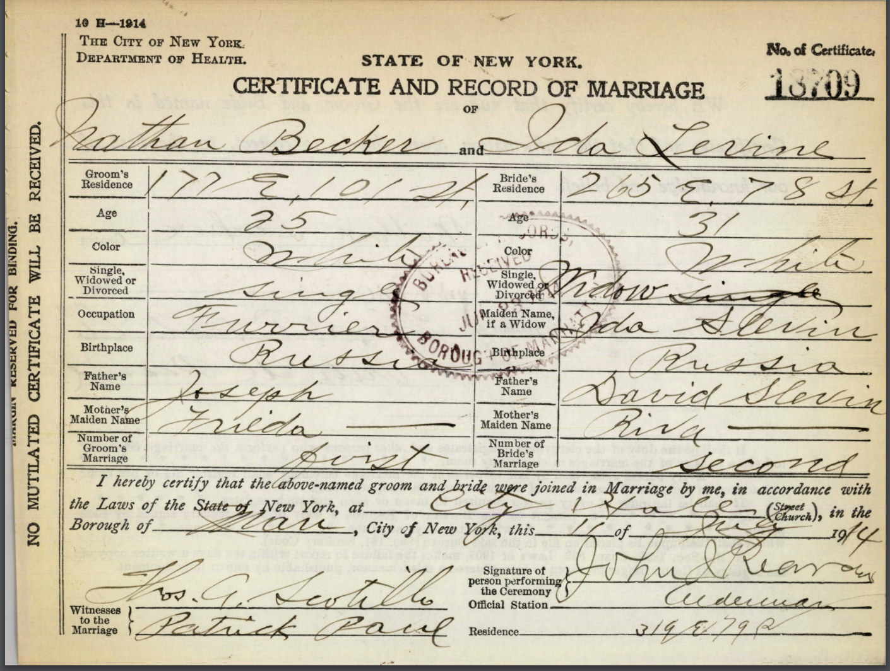
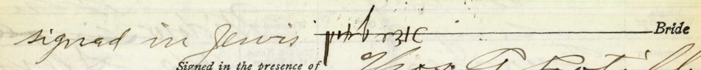
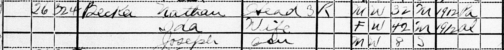

:::::::::::::::::::::::::::::::::::::: questions 

- Who was Ida's first husband? 
- When did Ida come to America?
- Was George Joseph Ida's son? 

::::::::::::::::::::::::::::::::::::::::::::::::

::::::::::::::::::::::::::::::::::::: objectives

- Some
- stuff
- here

::::::::::::::::::::::::::::::::::::::::::::::::

Ida Levin married Nathan Becker (my grandfather-in-law) on July 11, 1914. She was 31 years old and widowed. Her married name is listed as Ida Slevin. 

{alt='Ida and Nathan marriage certificate'}

She signed her name in Hebrew (or possibly Yiddish) on the marriage certificate. 

{alt='Ida Levine signature'}

She lived at 265 E. 78th street, about a mile and a half from Nathan Becker. The location is now a tapas bar. 

{alt='Google streetview image of 265 E 78th street'}

Four years later, in the 1920 census, they are living together with an 8 year old son (Joseph, aka George Joseph) at 176 E. 101st Street. 

{alt='Nathan Becker household in 1920 census'}

In terms of naturalization status, Nathan is listed as "Papers" (having submitted papers declaring intent to naturalize as a citizen), Ida is listed as "Alien" and Joseph is listed as born in New York. Ida and Nathan are both marked as having entered the US in 1912. 

In terms of age, Ida is listed as 31 on her 1914 marriage license and as 42 on the 1920 census, making her likely year of birth somewhere between 1878 and 1883. 

Possible Ida Levins

| Name | Year | Age | Birth Year | Other people listed on record | Individual ID |
| ---- | ---- | --- |  --------- | ---------------------------- | ---- | 
| Ida Slevin | 1901 | 17 | 1884 | (servant in Canada) | |
| Ida Levin | 1911 | 28 | 1883 | Hyman (6), Dora (5), Alice (3), Lena (1), Morris (husband) | A | 
| Ida Levin | 1910 | 27 | 1883 | Rosie (9), Sophie (14), Joseph (4), Oscar (7), Yetta (13), Morris (husband) 
| Ida Levin | 1916 | 32 | 1884 | Max (husband) |  |
| Ida Becker | 1930 | 57 | 1873 | Sadie, Dorothy, Arthur, Bella | B | 
| Ida Becker | 1940 | 68 | 1872 | Arthur, Sadie, Belle | B | 
| Ida Becker | 1940 | 53 | 1887 | Bertha and Joseph Hoffman |
| Ida Becker | 1940 | 55 | 1885 | Beatrice, Dorothy, Seloran, Eleanor, George (24) |
| Ita Levin | 1929 | 44 |  1885 | Leiba, Elia, Joseph (20) | 
| Ida Becker | 1910 |  | | Jacob Levin (husband), Ethel Levin (death certificate) | 
| Ida Becker | 1940 | 50 | 1890 | Lily, Bernard | 

- Was Ida married to her first husband (Levin) before coming to America? If she came in 1912, then she would have had to have been married already - unless she got married and her first husband died a year later and then she married Nathan right away? 

 

