:::::::::::::::::::::::::::::::::::::: questions 

- How do you write a lesson using Markdown and `{sandpaper}`?

::::::::::::::::::::::::::::::::::::::::::::::::

::::::::::::::::::::::::::::::::::::: objectives

- Explain how to use markdown with The Carpentries Workbench
- Demonstrate how to include pieces of code, figures, and nested challenge blocks

::::::::::::::::::::::::::::::::::::::::::::::::

Ok, so my son is in second grade and was assigned a family tree to fill out. We went to visit his grandfather (my father-in-law, Mark Becker) over Thanksgiving break and asked him the (what I thought was) simple question of "What was your grandmother's name?" The answer that I got was a convoluted story about 
his father (George) being (possibly) kidnapped by *his* father (Nathan), and trafficked across the country with a name change. So I started doing some digging and this is what I was able to discover so far. 

## Where to Start?

My father-in-law didn't have a lot of concrete knowledge about his family history, but he did know 
that his grandfather (Nathan) owned a store in Azusa, California. I was able to find a draft registration card for Nathan Becker with a place of residence and business on 200 Azusa Ave, Azusa California. The draft registration matches Mark's knowledge of his grandfather originally being from Russia. Although, it was probably modern-day Ukraine based on his place of birth (Keif). 

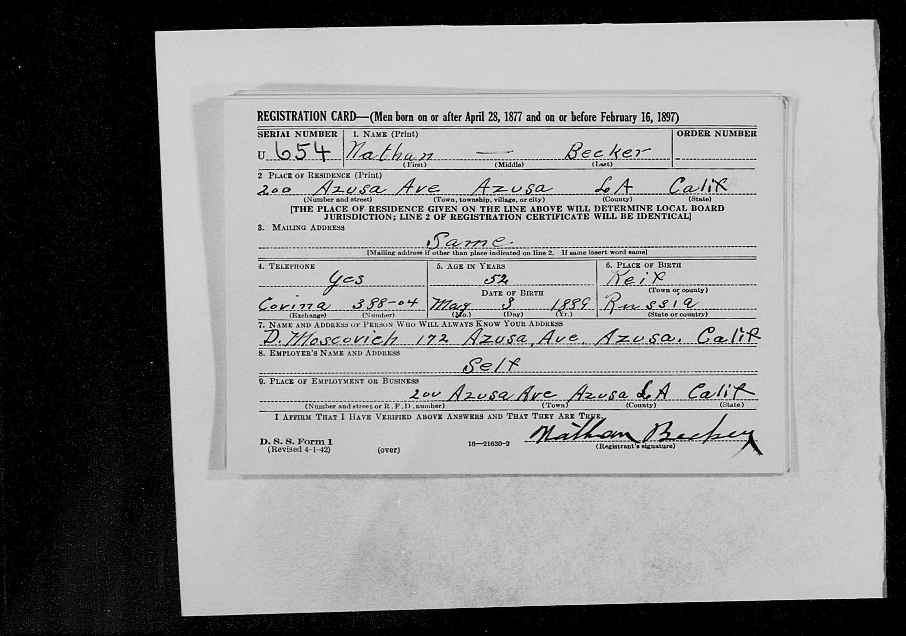{alt='WW2 draft registration card of Nathan Becker'}

Note the date of birth (May 3, 1889). This will be listed variously as May 8th on different documents. 

Based on the known place of residence in 1941, I next located the 1940 census record, which shows Nathan as living with wife (Rose), and sons Julius (age 19) and Tully (age 7). This matches Mark's knowledge of his father being raised by a woman named Rose, who he knew as not his biological mother. 

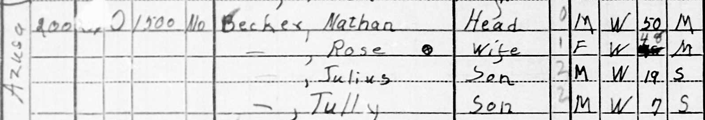{alt='Census page excerpt for household of Nathan Becker, 1940'}

Mark's father (George Joseph) was living in the household in the 1930 census.

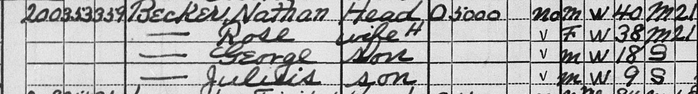{alt='Census page excerpt for household of Nathan Becker, 1930'}

He was no longer living with the household by the time of the 1940 census, probably because he had gotten married in 1935. 

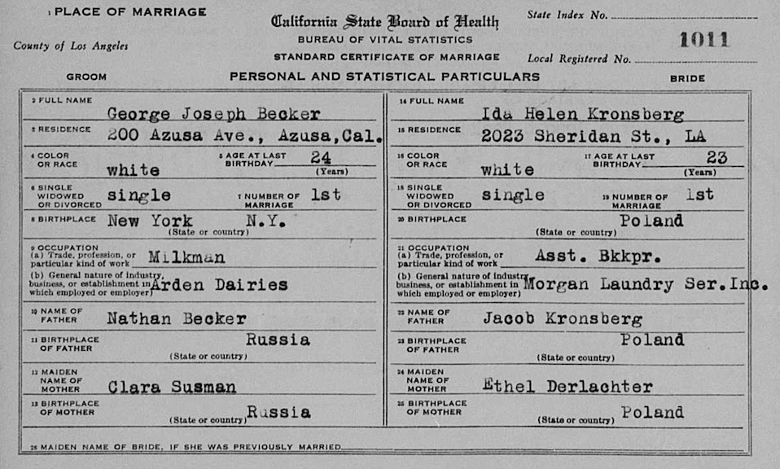{alt='Marriage license of George Becker and Ida'}

You may notice that George Joseph's mother is listed as one Clara Susman, not Rose. This will be important later. Also, please note that Mark's mother is not named Ida, and he didn't know his father had been previously married!

A Nathan Becker and Rose Goldman were married in Los Angeles on 16 July, 1924. The ages of this Nathan and Rose match up with those listed in the census records. Both are listed as being from Russia, which matches the 1930 census (however, Rose is listed as being from Lithuania on the 1940 census). The 1930 census lists the year of immigration to the United States for Rose as 1908 and for Nathan as 1910. 

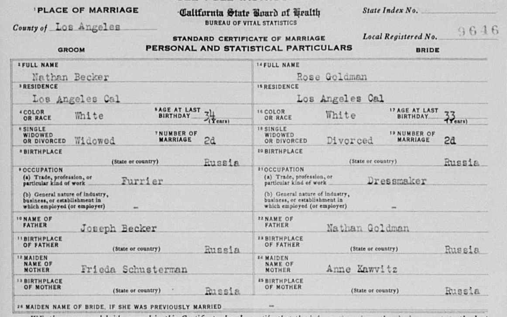{alt='Marriage license of Nathan Becker and Rose'}

From this marriage certificate, we now have the names of Nathan's parents - Joseph Becker and Frieda Schusterman. George Joseph may have been named after his grandfather Joseph. 

This is where things start to get interesting. Mark's family story says that his grandfather (Nathan) moved to California with his young son, leaving a previous wife behind in New York. 

In the 1920 census, we find a Nathan Becker living in New York with his wife Ida and son Joseph. 

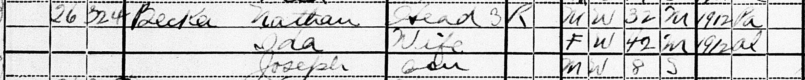{alt='Census page excerpt for household of Nathan Becker, 1920'}

Now, there were quite a few Russian-born Nathan Beckers in New York in the 1920s - how could we know if this is the right one? Well we have a couple of pieces of evidence. First, the ages match for both Nathan and his son (assuming this "Joseph" is the same child who was listed as "George" on the 1930 census and is referred to as "George Joseph" in his marriage license). Secondly, on this census record, Nathan Becker lists his year of entry into the United States as 1912, which, ok, isn't quite the same as the 1910 listed on the 1930 census, but I've done enough digging in old records to know things are often off by a year or two. A third piece of evidence is that Nathan lists his occupation as "Furrier". Why does this matter, you ask? Well pay attention now. 

A Nathan Becker, born in Kiev Russia, and living in New York, registered his exemption for the WWI draft in 1917. On his draft exemption card, he lists his occupation as "Furrier". And, furthermore, his date of birth is listed as **May 3rd, 1889**!!!

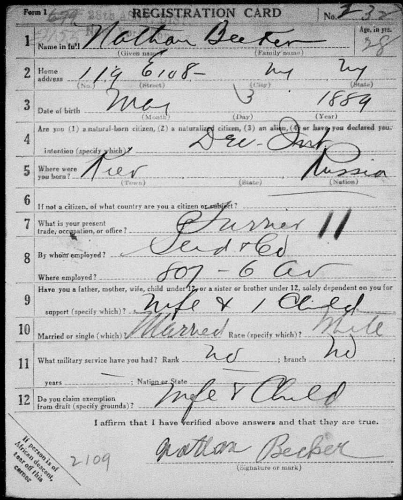{alt='Draft registration for Nathan Becker, 1917'}

My last (and most tantalizing) piece of evidence so far, is a 1914 marriage record between Nathan Becker (born 1889 in Russia, son of Joseph and Frieda) and Ida Slevin Levine (age 31, widowed) in New York. Based on Nathan's parents' names, this really seems to be the same as our guy who owns the store in Azusa in 1940, and would make a solid connection with the 1920 census record. 

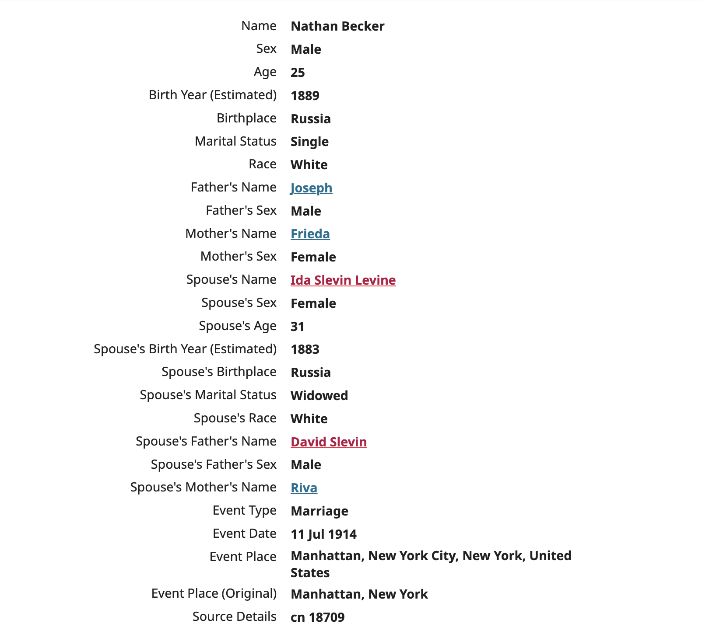{alt='Text record of marriage between Nathan and Ida'}

My remaining problems are three fold: 

1) I haven't been able to find an actual record of this marriage certificate, only the text record. 
2) Why is George Joseph's mother listed as "Clara" on his marriage record? and
3) Whose son is George Joseph anyway? He's born in 1911/1912 in New York (according to his census records), but his father didn't enter the country until 1910 or 1912 and didn't get married until 1914 (to a woman who was previously married). Is he Ida's son from the previous marriage and Nathan gave told him a bogus name for his mother when he needed something for the marriage record? 

This is definitely more in-depth than my son's 2nd grade teacher expected us to go for a Thanksgiving weekend family history project! :joy:

## Later

I found it!!

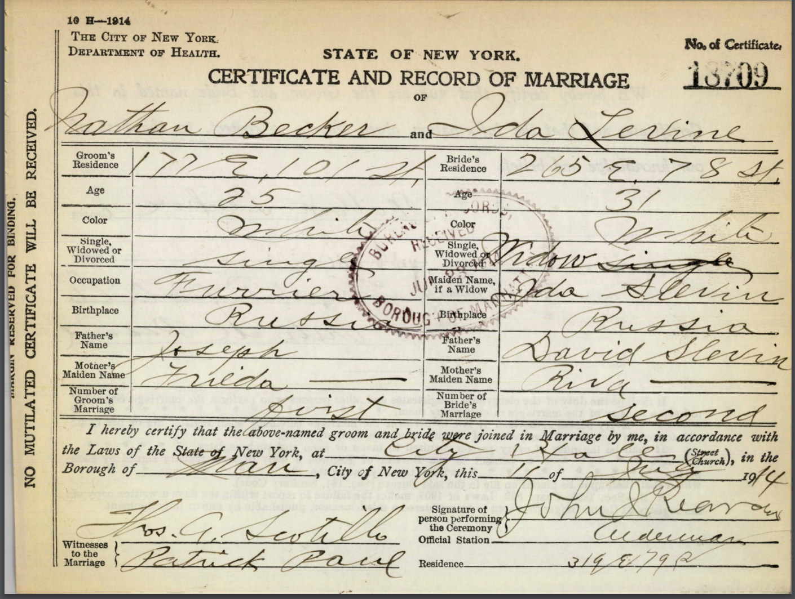{alt='Marriage certificate for Nathan and Ida'}

Nathan Becker, parents Frieda and Joseph, married a widow named Ida Levine in 1914 in New York!

And check this out!!!

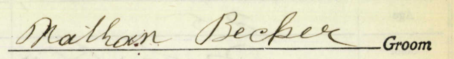{alt='Nathans signature 1914'}
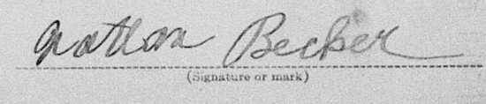{alt='Nathans signature 1917'}
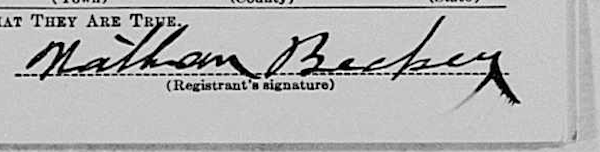{alt='Nathans signature 1941'}

## Questions

- What happens to Ida Levine after Nathan leaves for California?
- When did Nathan marry Rose? 
- What happens to Ida Helen Kronsberg? (George Joseph's first wife)
- Where and when was George Joseph born? And who are his biological parents? 
- What is up with Jeanne Sadie Goldfaden's (George's second wife) name changing all over the place? 